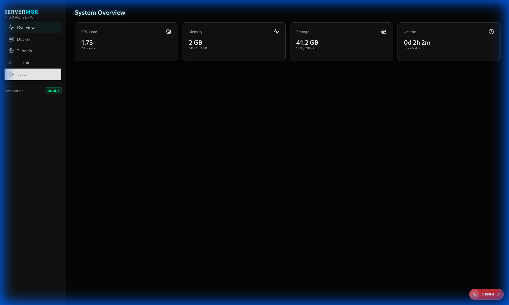
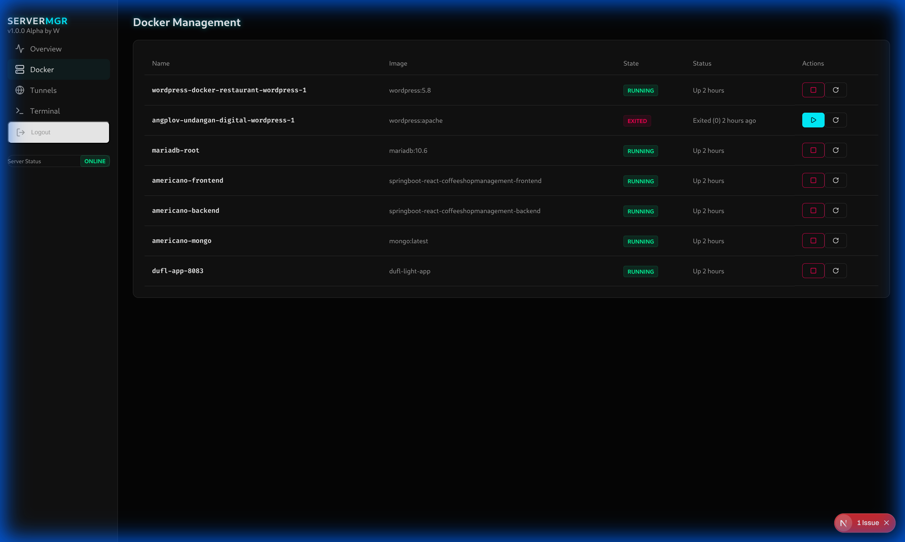
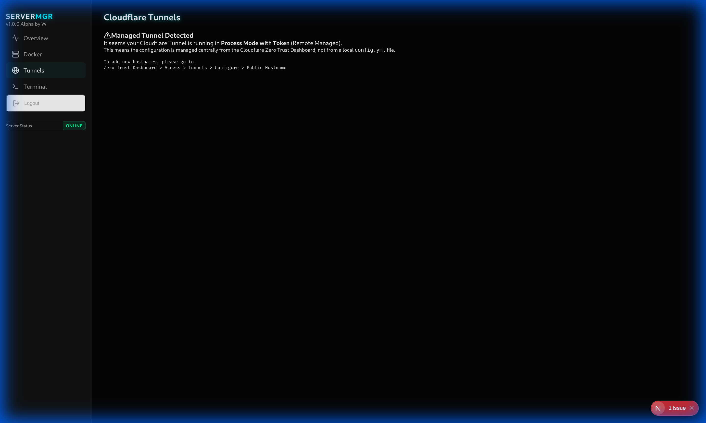
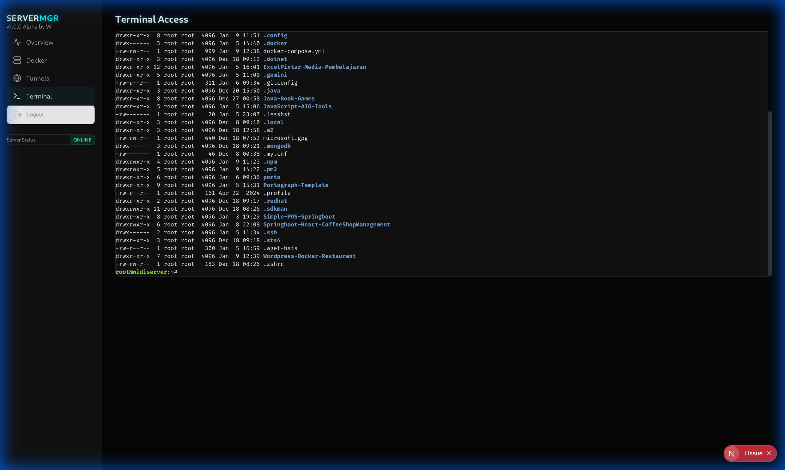
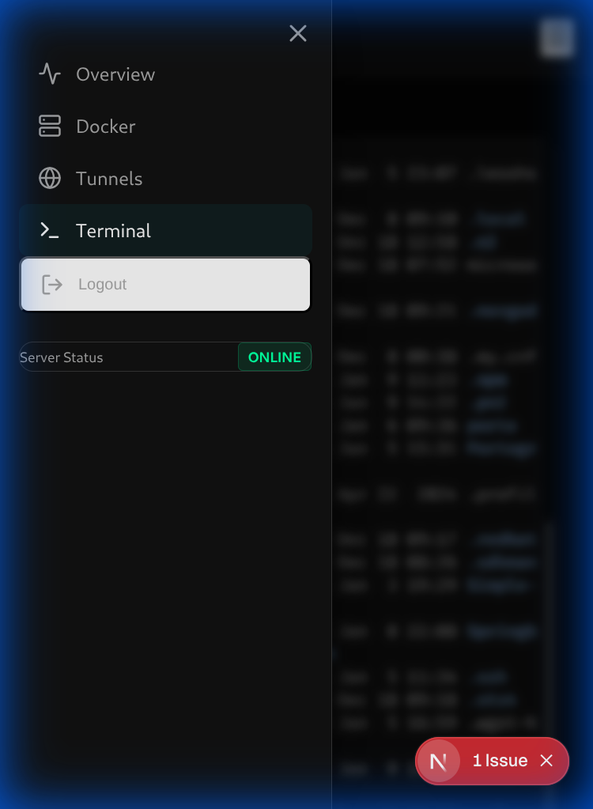

# Tunneled Server Manager

A modern, responsive, and secure web-based server management dashboard built with Next.js. Monitor system resources, manage Docker containers, control Cloudflare Tunnels, and access a web-based terminal—all from a single, beautiful interface.



## 🚀 Why Use This?

**The Perfect Solution for Home Labs & ISP-NAT Environments.**

Accessing your home server remotely can be a pain, especially if your ISP doesn't provide a Static IP or puts you behind CG-NAT. This project solves that problem eleganty.

By leveraging **Cloudflare Tunnels**, this dashboard allows you to securely access your server's SSH terminal, Docker containers, and system stats from anywhere in the world—**without port forwarding, without exposing your public IP, and without needing a static IP address.**

## Features

*   **System Monitoring:** Real-time visualization of CPU usage, Memory, Disk Space, and Server Uptime.
*   **Docker Management:** View, start, stop, restart, and remove Docker containers. Monitor container status and image details.
*   **Web Terminal:** Fully functional, secure web-based terminal (using WebSocket) to execute shell commands directly on your server.
*   **Cloudflare Tunnels:** Manage and monitor your Cloudflare Tunnel configurations and status.
*   **Responsive Design:** Optimized for both desktop and mobile devices with a sleek "cyberpunk" aesthetic.
*   **Secure:**
    *   Protected by password authentication.
    *   HttpOnly cookies for session management.
    *   DevTools blocking (client-side) to deter casual inspection.
    *   Execution of arbitrary commands is protected behind authentication.

## 🔮 Upcoming Features (Roadmap)

We are constantly expanding! Stay tuned for these powerful additions:

*   **Node Manager:** Easy management of Node.js versions and processes.
*   **Server Package Manager:** GUI for `apt` / `yum` to install and update system packages.
*   **PHP Manager:** Switch PHP versions and manage extensions effortlessly.
*   **Database Manager:** Integrated GUI for managing MySQL/PostgreSQL databases.
*   **File Manager:** Browse and edit server files directly from the browser.

## Screenshots

### 🖥️ Dashboard
Get a quick overview of your server's health.


### 🐳 Docker Management
Easily manage your containers.


### 🌐 Cloudflare Tunnels
Monitor your tunnel connections.


### ⌨️ Web Terminal
Direct ssh-like access from your browser.


### 📱 Mobile View
Fully responsive interface for management on the go.


## Technology Stack

*   **Framework:** Next.js 14+ (App Router)
*   **Language:** TypeScript
*   **Styling:** Tailwind CSS + CSS Modules (Custom Cyberpunk Theme)
*   **Backend:** Node.js (integrated via Next.js API Routes)
*   **Real-time:** Socket.IO (for Terminal)
*   **System Interactions:** `node-pty` (Terminal), `dockerode` (Docker), `systeminformation` (Stats)

## Getting Started

### Prerequisites

*   Node.js 18+
*   Docker (if using Docker features)
*   Cloudflare Tunnel (cloudflared) installed (if using Tunnel features)

### Installation

1.  **Clone the repository:**
    ```bash
    git clone https://github.com/yourusername/server-manager.git
    cd server-manager
    ```

2.  **Install dependencies:**
    ```bash
    npm install
    ```

3.  **Setup Environment Variables:**
    Create a `.env` file in the root directory:
    ```env
    # Password for login
    AUTH_PASSWORD=YourSecurePassword
    ```

4.  **Run Development Server:**
    ```bash
    npm run dev
    ```
    Access the app at `http://localhost:3000`.

### Deployment (Production)

1.  **Build the application:**
    ```bash
    npm run build
    ```

2.  **Start the server:**
    ```bash
    npm start
    ```
    Or use PM2 for process management:
    ```bash
    pm2 start npm --name "server-manager" -- start
    ```

## Security Note

This application provides root-level access (via terminal and docker controls) to the underlying server. Ensure you:
*   Use a strong `AUTH_PASSWORD`.
*   Run this application behind a secure reverse proxy (like Nginx or Cloudflare Tunnel) with HTTPS.
*   Do not expose the raw port (3000/8001) directly to the internet without protection.

## License

[FREE AS F00CK](LICENSE)
